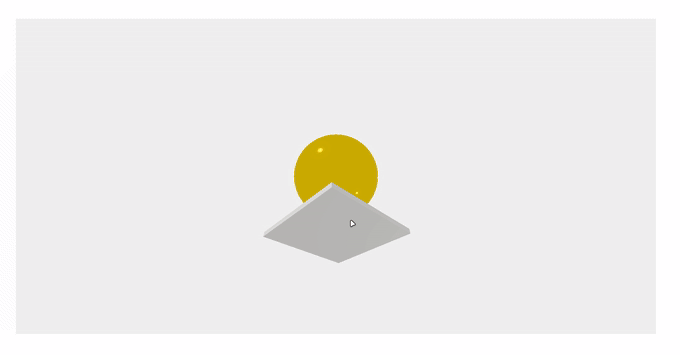

## ⭐ About
This is a simple project to show how Three.js works

## 📚 Learnings
- How to set: scene, camera, object, light and render on Three.js
- Different types of materials, lights and cameras
- Animations and controls
- Mesh

## 🚀 Technologies/Tools
- Three.js
- JavaScript
- Node Package Manage
- Vite

## 🎥 Project


## ▶️ Running
Clone the project with:
```bash
  git clone https://github.com/DevBonatto/RocketMovies
```

Then use this command to install the dependencies:
```bash
  npm install
```

Develop start
```bash
  npm run dev
```